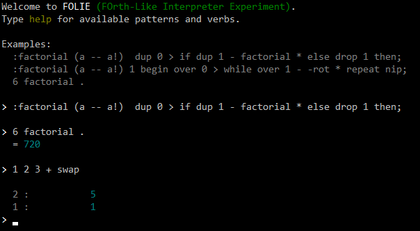

# Forth Like Interpreter Experiment

A toy interpreter for my own flavor of a Forth like language, with some inspirations from HP RPL.  
For learning, education, and experimentation purposes only.

## Languages references

Forth tutorial : https://www.forth.com/starting-forth  
HP RPL : https://en.m.wikipedia.org/wiki/RPL_(programming_language)

## The experiment

